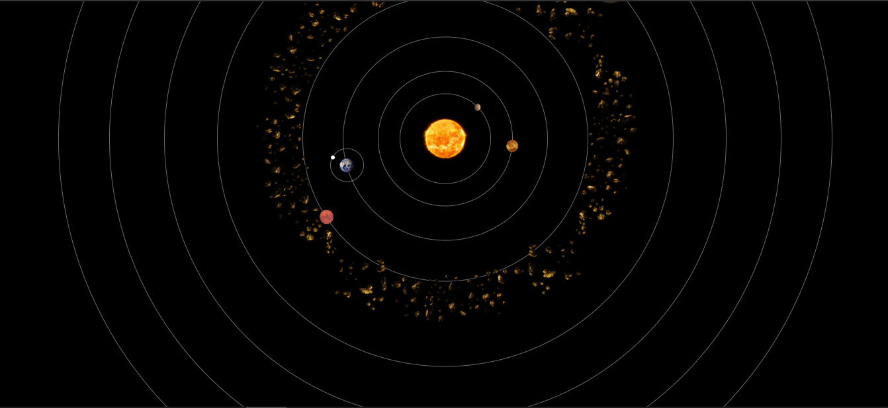

# SISTEMA SOLAR VOLUME 3
😏USE ESSE CÓDIGO EM HTML E CSS PARA VER OS PLANETAS ORBITANDO O SOL.

 <br>

## DESCRIÇÃO:
O objetivo deste projeto é oferecer uma representação visual e interativa do sistema solar. Aqui estão as principais funcionalidades implementadas:
- **Modelo em 2D**: O projeto exibe um modelo interativo do sistema solar, mostrando os planetas e asteroides em suas órbitas ao redor do sol.
- **Visualização realista**: Cada planeta é representado por uma imagem realista correspondente, capturando a aparência distinta de cada um deles.

## COMO USAR?
* Clone o repositório para o seu sistema local:

```bash
git clone https://github.com/VILHALVA/SISTEMA-SOLAR-VOLUME-3.git
```

* Navegue até o diretório do projeto.

```bash
cd SISTEMA-SOLAR-VOLUME-3
```

* Descompacte o arquivo ZIP (se você baixou manualmente):

```bash
unzip SISTEMA-SOLAR-VOLUME-3.zip
```
* Abra o arquivo `CODIGO.html` em seu navegador de preferência.

## NÃO SABE?
- Entendemos que para manipular arquivos em `HTML`, `CSS` e outras linguagens relacionadas, é necessário possuir conhecimento nessas áreas. Para auxiliar nesse aprendizado, oferecemos cursos gratuitos disponíveis:
* [Curso de HTML e CSS](https://github.com/VILHALVA/CURSO-DE-HTML-E-CSS)
* [Curso de JavaScript](https://github.com/VILHALVA/CURSO-DE-JAVASCRIPT)
* [Confira mais cursos](https://github.com/VILHALVA?tab=repositories&q=+topic:CURSO)

## CREDITOS:
- [PROJETO CRIADO PELO: "MRGONZATTO"](https://github.com/mrgonzatto/SistemaSolar-HTML-CSS-JS)
- [PROJETO EDITADO PELO VILHALVA](https://github.com/VILHALVA)
- [ESTÁ DISPONIVEL NO SITE](https://vilhalva.github.io/STYLER/STYLER.html)


